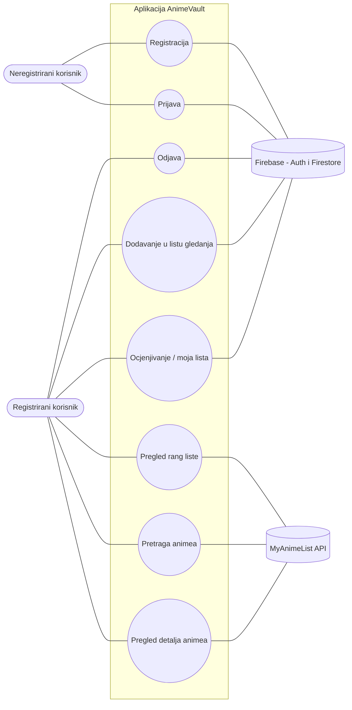
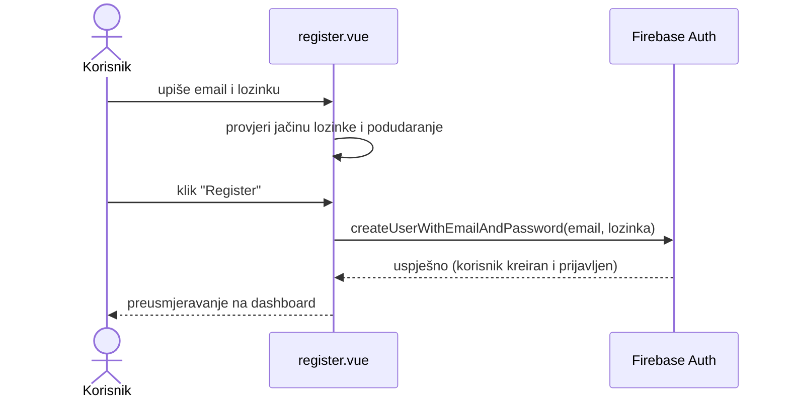
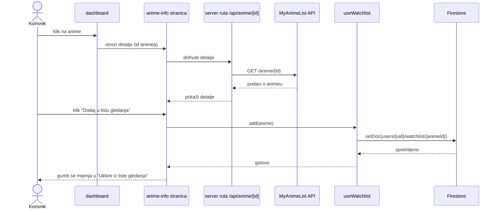
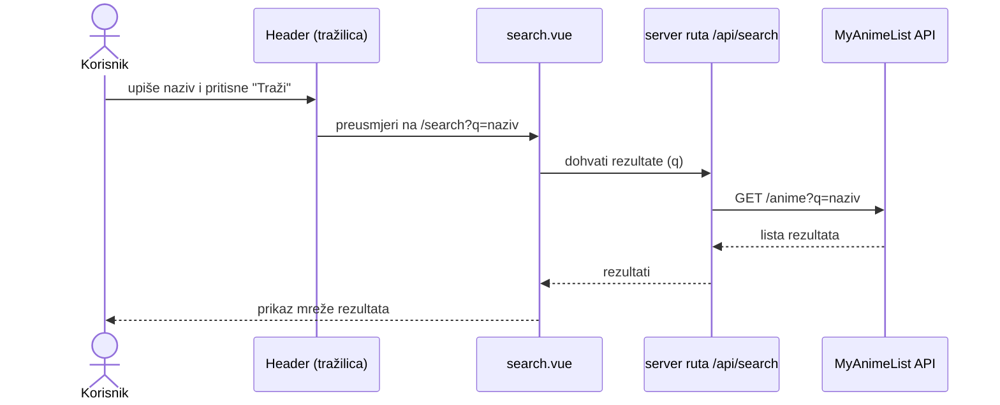
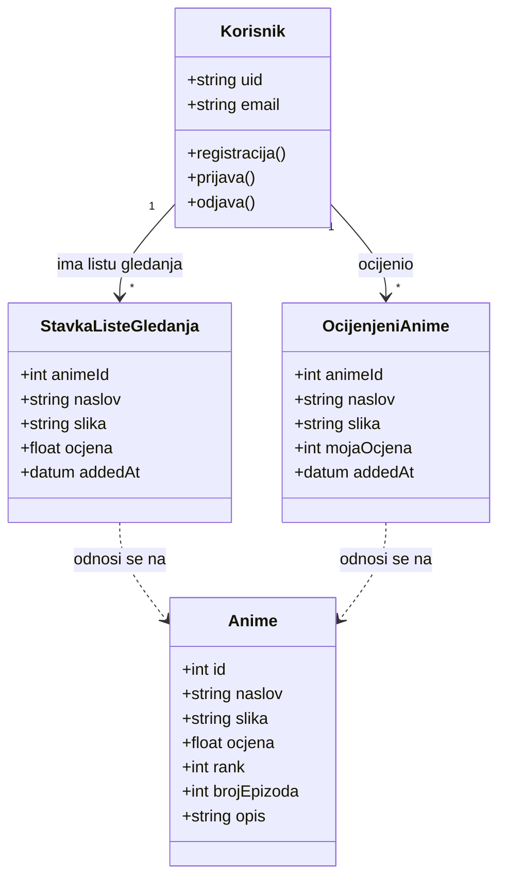
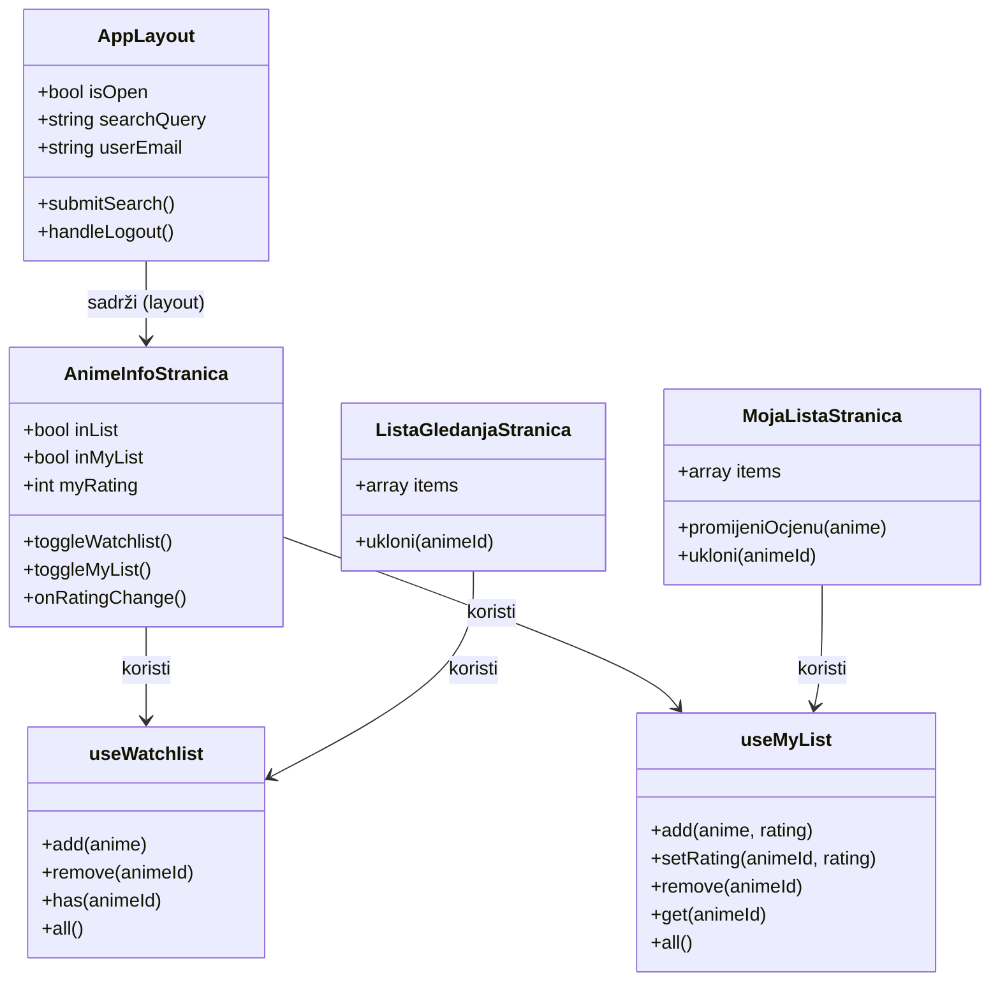

# AnimeVault – Projektna dokumentacija

**Kolegij:** Programsko inženjerstvo
**Student:** Jakov Pejaković
**Mentor:** doc. dr. sc. Nikola Tanković
**Akademska godina:** 2025./2026.

---

## 1. Sažetak

AnimeVault je web aplikacija za ljubitelje animea koja korisnicima omogućuje da na jednom mjestu
pregledavaju najbolje ocijenjene animee, traže naslove po imenu, čitaju osnovne informacije o
pojedinom animeu te vode dvije osobne liste: **listu gledanja** (animei koje tek žele pogledati) i
**moju listu** (animei koje su pogledali i sami ocijenili od 1 do 10, koja se automatski slaže po ocjeni).

Podaci o animeima dolaze s vanjskog servisa **MyAnimeList (MAL)** preko njihovog API-ja, dok se
prijava korisnika i spremanje osobnih listi rješavaju pomoću **Firebasea** (Authentication i Firestore).
Aplikacija je napravljena u **Nuxt-u (Vue 3)** uz **Tailwind CSS** za izgled.

Cilj aplikacije je da korisnik ima jednostavno, pregledno mjesto gdje može pratiti što je gledao i što
planira gledati, bez nepotrebnih komplikacija.

---

## 2. Uvod

AnimeVault je jednostavna aplikacija namijenjena ljudima koji gledaju anime i žele imati pregled nad
svojim gledanjem. Kada gledaš puno serija, lako je zaboraviti što si već pogledao, koju si ocjenu dao
nekom naslovu ili što si htio pogledati sljedeće. Ova aplikacija to rješava tako da svaki korisnik ima
svoj račun i svoje liste koje su spremljene u bazi, pa im može pristupiti s bilo kojeg uređaja.

**Ciljani korisnici** su prije svega mlađa publika i ljubitelji animea koji su navikli na aplikacije poput
MyAnimeLista, ali žele nešto jednostavnije i preglednije.

**Glavne prednosti** u odnosu na postojeća rješenja:

- vrlo jednostavno i čisto sučelje (bez pretrpanosti informacijama),
- podaci o animeima su uvijek svježi jer dolaze direktno s MyAnimeList API-ja,
- korisnik ima dvije jasno odvojene liste (što planira gledati i što je već ocijenio),
- "moja lista" se sama slaže po ocjeni, pa odmah vidiš svoje favorite na vrhu.

Aplikacija ne pokušava zamijeniti velike servise, nego ponuditi lakšu i bržu alternativu za osnovno
praćenje animea.

---

## 3. Motivacija

### 3.1. Ciljano tržište

Tržište su ljubitelji animea, kojih je jako puno i kojih iz godine u godinu ima sve više. Većina njih
prati veći broj serija istovremeno i treba nekakav način da to organizira. Danas to rade ili "u glavi",
ili preko velikih servisa koji znaju biti prekomplicirani za nekoga tko samo želi voditi jednostavan popis.

### 3.2. Postojeća i konkurentska rješenja

Postoji nekoliko poznatih rješenja:

- **MyAnimeList (MAL)** – najveća baza animea, ima liste i ocjene, ali sučelje je staro i pretrpano.
- **AniList** – modernije sučelje, ali i dalje dosta kompleksno za novog korisnika.
- **Excel / bilježnica** – neki ljudi jednostavno vode popis ručno, što je nepregledno i ne sinkronizira se.

AnimeVault se od njih razlikuje po tome što je namjerno jednostavan – fokusiran je samo na ono
najbitnije: pregled, pretraga, i dvije osobne liste.

### 3.3. SWOT analiza

| **Prednosti (Strengths)** | **Slabosti (Weaknesses)** |
|---|---|
| Jednostavno i pregledno sučelje | Ovisi o MyAnimeList API-ju (ako on padne, nema podataka) |
| Podaci su uvijek ažurni (MAL API) | Manje funkcija od velikih servisa |
| Osobne liste spremljene u oblaku (Firestore) | Nema društvenih funkcija (komentari, prijatelji) |
| Besplatno za korištenje | Nema personaliziranih preporuka |

| **Prilike (Opportunities)** | **Prijetnje (Threats)** |
|---|---|
| Sve veća popularnost animea | Veliki konkurenti (MAL, AniList) |
| Mogućnost dodavanja novih funkcija (statistika, preporuke) | Ograničenja/pravila MyAnimeList API-ja |
| Moguće proširenje na mobilnu aplikaciju | Ovisnost o Firebase besplatnom planu |

### 3.4. Predispozicije za korištenje

Za korištenje aplikacije potrebno je:

- pristup internetu,
- registriran MyAnimeList **Client ID** (da aplikacija može dohvaćati podatke s njihovog API-ja),
- Firebase projekt (za prijavu korisnika i bazu).

Korist od aplikacije imaju prije svega **krajnji korisnici** (ljubitelji animea), a posredno i
**MyAnimeList** jer se njihovi podaci dodatno koriste i promoviraju.

---

## 4. Razrada funkcionalnosti

### 4.1. Skupine korisnika

U aplikaciji postoje dvije skupine korisnika:

1. **Neregistrirani korisnik (gost)** – može samo pristupiti stranicama za prijavu i registraciju.
   Ne može vidjeti dashboard ni liste dok se ne prijavi.
2. **Registrirani (prijavljeni) korisnik** – ima pristup svim funkcijama: pregled rang liste,
   pretraga, pregled detalja animea, vođenje liste gledanja i moje liste, te odjava.

### 4.2. Use Case dijagram (cijeli sustav)

Aplikacija komunicira s dva vanjska sustava:

- **MyAnimeList API** – odatle dohvaćamo sve podatke o animeima (rang liste, pretraga, detalji).
- **Firebase** – Firebase Authentication služi za prijavu/registraciju, a Firestore za spremanje
  korisnikovih listi.

### 4.3. Opis korisničkih scenarija

- **Registracija:** korisnik upiše email i lozinku, aplikacija provjeri jačinu lozinke i podudaranje,
  te preko Firebasea kreira novi račun.
- **Prijava:** korisnik upiše podatke, Firebase provjeri jesu li ispravni i prijavi ga.
- **Pregled rang liste:** nakon prijave korisnik vidi dashboard s više sekcija animea (najbolji,
  trenutno se emitira, najpopularniji, nasumični izbor).
- **Pretraga:** korisnik u tražilicu gore upiše naziv, aplikacija dohvati rezultate s MAL-a.
- **Pregled detalja:** klikom na anime otvara se stranica s detaljima (ocjena, epizode, sezona, opis…).
- **Lista gledanja:** korisnik može dodati/ukloniti anime iz liste onoga što planira gledati.
- **Moja lista:** korisnik ocijeni pogledani anime (1–10), a lista se automatski poreda po ocjeni.

### 4.4. Use Case Sequence dijagrami

**Scenarij 1: Registracija korisnika**

**Scenarij 2: Dodavanje animea u listu gledanja**

**Scenarij 3: Pretraga animea**

### 4.5. Prototip sučelja

Aplikacija ima sljedeće glavne ekrane:

- **Prijava** (`/login`) – forma s emailom i lozinkom, poveznica na registraciju.
- **Registracija** (`/register`) – forma s provjerom jačine lozinke i potvrdom lozinke.
- **Dashboard** (`/dashboard`) – početni ekran s više sekcija animea i tražilicom u gornjoj traci.
- **Pretraga** (`/search`) – rezultati pretrage.
- **Detalji animea** (`/anime-info/[id]`) – sve informacije + gumbi za liste.
- **Lista gledanja** (`/lista-gledanja`) – animei koje korisnik planira gledati.
- **Moja lista** (`/moja-lista`) – ocijenjeni animei poredani po ocjeni.

Bočni izbornik (hamburger ☰ gore lijevo) služi za navigaciju između stranica te sadrži email
prijavljenog korisnika i gumb za odjavu.

> *(Ovdje ubaci jednostavne skice/wireframe ili screenshotove ekrana.)*

### 4.6. Klasni dijagram domene

Objašnjenje: jedan **Korisnik** može imati više stavki u listi gledanja i više ocijenjenih animea
(veza 1 prema više). `StavkaListeGledanja` i `OcijenjeniAnime` su zapravo "spremljene kopije"
osnovnih podataka o animeu (naslov, slika, ocjena) koje čuvamo u bazi za tog korisnika, a puni
podaci o **Animeu** se po potrebi dohvaćaju s MyAnimeList API-ja.

---

## 5. Implementacija

Aplikacija je napravljena u **Nuxt-u (Vue 3)**. Svaka stranica i komponenta je zapravo Vue komponenta,
pa smo ih u dijagramu prikazali kao klase. Podaci se dohvaćaju preko **server ruta** (koje su posrednik
prema MyAnimeList API-ju) i preko **Firebasea** (prijava i baza).

### 5.1. Dijagram komponenti (kako je riješena funkcionalnost listi)

Ključna ideja je da smo logiku za rad s bazom izdvojili u **composable** funkcije (`useWatchlist` i
`useMyList`) – tako se ista logika koristi na više stranica bez ponavljanja koda.

### 5.2. Popis komponenti i njihovih sastavnica

**Stranice (pages):**

- **login.vue** – prijava. Varijable: `email`, `password`, `message`, `error`. Metoda `login()` – poziva
  Firebase `signInWithEmailAndPassword` i preusmjerava na dashboard.
- **register.vue** – registracija. Varijable: `email`, `password`, `confirmPassword`, `showPassword`.
  Computed provjere jačine lozinke (`hasMinLength`, `hasUpper`, `hasNumber`, `hasSpecial`, `strength`,
  `passwordsMatch`, `isValid`). Metoda `register()`.
- **dashboard.vue** – prikazuje 4 sekcije animea koristeći komponentu `AnimeSection`.
- **search.vue** – pretraga. Čita `?q=` iz URL-a i dohvaća rezultate preko `useFetch`.
- **anime-info/[id].vue** – detalji animea + akcije za liste (opisano gore).
- **moja-lista.vue** – prikaz ocijenjenih animea poredanih po ocjeni.
- **lista-gledanja.vue** – prikaz animea iz liste gledanja.

**Layout:**

- **app.vue** – zajednički okvir (gornja traka s tražilicom, bočni izbornik, email korisnika, odjava).
  Varijable: `isOpen`, `searchQuery`, `userEmail`. Metode: `submitSearch()`, `handleLogout()`.

**Komponente (components):**

- **AnimeSection.vue** – jedna sekcija animea na dashboardu. Parametri (props): `title`, `rankingType`,
  `limit`, `random`. Sama dohvaća podatke preko `useFetch`.

**Composables (logika za bazu):**

- **useWatchlist.ts** – rad s listom gledanja. Metode: `add(anime)`, `remove(animeId)`,
  `has(animeId)`, `all()`.
- **useMyList.ts** – rad s mojom listom (ocjene). Metode: `add(anime, rating)`,
  `setRating(animeId, rating)`, `remove(animeId)`, `get(animeId)`, `all()`.

**Plugin i middleware:**

- **firebase.client.ts** – inicijalizira Firebase i daje pristup servisima `$auth` (prijava) i `$db` (baza).
- **auth.ts (middleware)** – čuva stranice tako da neprijavljenog korisnika vraća na `/login`.

**Server rute (posrednik prema MAL API-ju):**

- **/api/anime** – dohvaća rang listu (parametri: `rankingType`, `limit`, `random`).
- **/api/anime/[id]** – dohvaća detalje jednog animea po ID-u.
- **/api/search** – pretraga animea po nazivu (parametar `q`).

### 5.3. Baza podataka (Firestore)

Podaci se spremaju po korisniku:

- `users/{uid}/watchlist/{animeId}` – stavke liste gledanja,
- `users/{uid}/mylist/{animeId}` – ocijenjeni animei.

Svaki dokument sadrži osnovne podatke o animeu (naziv, slika, ocjena) i, kod moje liste, korisnikovu
ocjenu (`rating`).

---

## 6. Korisničke upute

> *(Uz svaki korak ubaci stvarni screenshot iz aplikacije na naznačenom mjestu.)*

### 6.1. Registracija

1. Otvori aplikaciju – prikazat će se ekran za prijavu. Klikni na **"Registrirajte se"**.
2. Upiši svoju email adresu i lozinku. Dok tipkaš lozinku, ispod se pojavljuje traka i popis uvjeta
   (najmanje 8 znakova, veliko slovo, broj, specijalni znak).
3. Ponovi lozinku u drugo polje – mora se podudarati.
4. Kad su svi uvjeti ispunjeni (svi ✓ zeleni), gumb **"Register"** postaje aktivan. Klikni ga.
5. Automatski ćeš biti prijavljen i preusmjeren na početni ekran.

> *(SLIKA: ekran registracije s ispunjenim uvjetima)*

### 6.2. Prijava

1. Na ekranu za prijavu upiši email i lozinku.
2. Klikni **"Prijavi me"**.
3. Ako su podaci ispravni, otvara se dashboard. Ako nisu, prikazat će se poruka o grešci.

> *(SLIKA: ekran prijave)*

### 6.3. Pregled animea (dashboard)

1. Nakon prijave vidiš više sekcija: *Najbolje rangirani*, *Trenutno se emitira*, *Najpopularnije*
   i *Otkrij – možda ti se svidi*.
2. Svaka sekcija prikazuje niz animea s ocjenom i rangom.

> *(SLIKA: dashboard sa sekcijama)*

### 6.4. Pretraga

1. U tražilicu u gornjoj traci upiši naziv animea (npr. "Naruto").
2. Pritisni **"Traži"** ili Enter.
3. Prikazat će se rezultati; klikni bilo koji za detalje.

> *(SLIKA: rezultati pretrage)*

### 6.5. Detalji animea i dodavanje na liste

1. Klikni na bilo koji anime – otvara se stranica s detaljima (ocjena, epizode, sezona, studio, žanrovi, opis).
2. Klikni **"+ Dodaj u listu gledanja"** ako ga planiraš gledati.
3. Ako si ga već pogledao, odaberi ocjenu (1–10) i klikni **"+ Dodaj u moju listu"**.

> *(SLIKA: stranica s detaljima animea)*

### 6.6. Lista gledanja

1. Otvori bočni izbornik (☰) i klikni **"Lista gledanja"**.
2. Vidiš sve animee koje planiraš gledati.
3. Klikni **"Ukloni"** da makneš neki anime s liste.

> *(SLIKA: lista gledanja)*

### 6.7. Moja anime lista

1. U bočnom izborniku klikni **"Moja anime lista"**.
2. Animei su poredani po tvojoj ocjeni (najbolji na vrhu).
3. Ocjenu možeš promijeniti u padajućem izborniku – lista se odmah presloži.

> *(SLIKA: moja lista poredana po ocjeni)*

### 6.8. Odjava

1. Otvori bočni izbornik (☰).
2. Pri dnu klikni **"Odjava"** – vratit ćeš se na ekran za prijavu.

> *(SLIKA: bočni izbornik s gumbom Odjava)*
